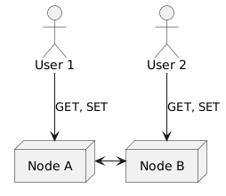
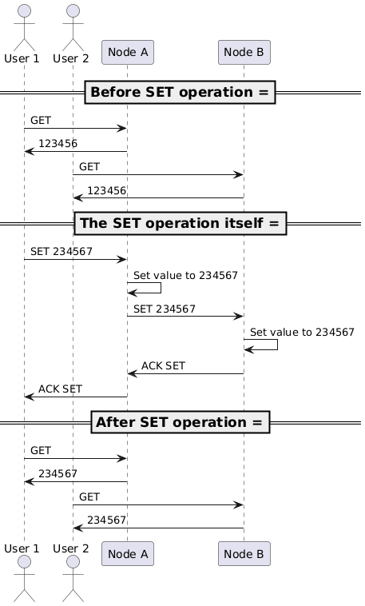
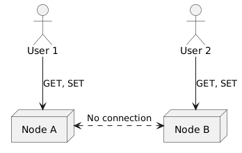
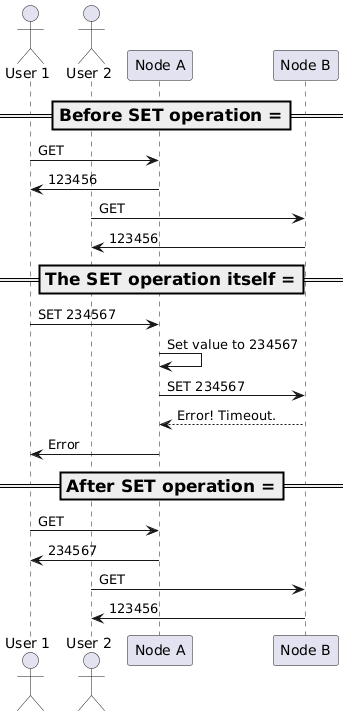
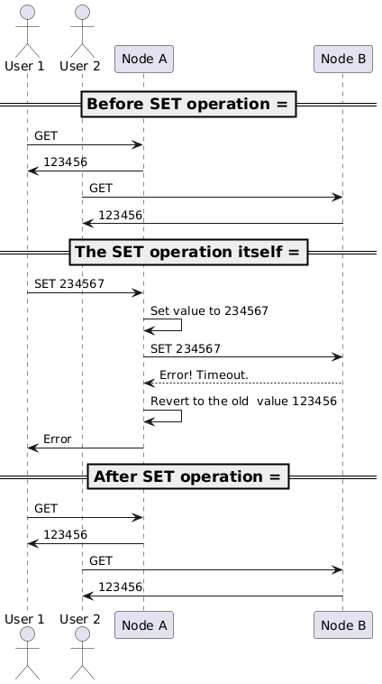
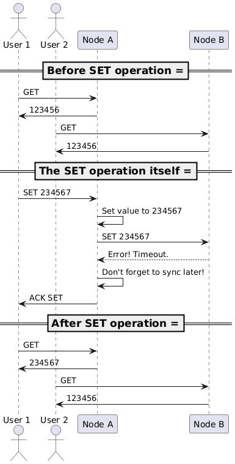
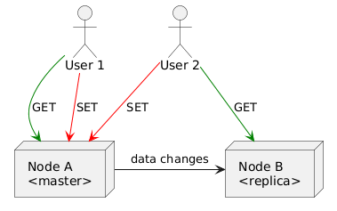
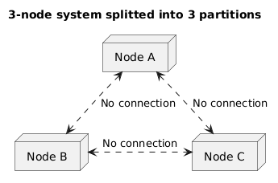
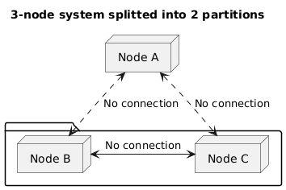

The CAP theorem is a fundamental principle in distributed systems that every seasoned backend engineer is expected to be familiar with.
But what exactly does it say — not the words but the meaning?
Let's try to derive the theorem from the ground up — and hopefully we will develop deeper understanding of the theorem.

As a remark, I'd like to note: from time to time, software engineers tend to say _"CAP theorem says that you can only have two out of three properties — C, A and P"_.
I hope that by the end of this article, you will see why this is not an accurate statement of the theorem and doesn't really reflect its meaning.

# Core terminology

Before we start, let's clarify the core terminology used in the CAP theorem.
The theorem talks about three properties of distributed systems:
consistency, availability and partition tolerance.
These terms might be ambiguous, so let's define them clearly:

- **Consistency.**

  In the CAP theorem, consistency means _linearizability_ — every read operation returns the most recent write operation's value.
  In other words, all nodes in the distributed system see the same data at the same time.

  Therefore, here we only speak about strong consistency.
  Eventual consistency is out of scope for the CAP theorem, as well as other kinds of consistency.

- **Availability.**

  A distributed system is considered available if every request (read or write) eventually receives a response,
  regardless of the state of any individual node in the system.

  Availability means that every operational node of the system can respond to all supported kinds of requests.
  Degrading the system's functionality (e.g., switching it into a read-only mode) is considered as a loss of availability.

- **Partition tolerance:**

  This is the trickiest term to define — and often is the hardest to remember.

  A distributed system is partition tolerant if it continues to operate despite arbitrary network partitions.
  A network partition is a communication breakdown between nodes in the system — when nodes cannot exchange messages with each other.

  However, if a distributed system would be rendered inoperational due to a network failure and won't recover once the network is restored,
  requiring manual intervention to bring it back online, it's considered not partition tolerant.

  It's worth noting that the CAP theorem addresses only one kind of failure — bi-directional network failure
  that makes certain nodes unable to communicate with other nodes.
  The theorem does not consider other types of failures: node crashes, message losses, latency spikes, uni-directional communication failures, etc.

# Setting up the stage

Now, once we have defined the core terminology, let's set the stage for our thought experiment!

Let's consider a simple distributed system that:

- has two nodes and a duplex network connection between them;
- stores a single integer value;
- allows any client to read this value from any of the nodes (we will call it `the GET request`);
- allows any client to write new value into any of the nodes (we will call it `the SET request`);
- keeps the value synchronized across all nodes (assuming the network is healthy and the system is operational).



For illustration, here's a simple API definition for such a system:

```protobuf
// Here's an example of the system's API:
package our.example.system;

service CapTheoremService {
  // The GET request retrieves the current value.
  rpc Get (GetRequest) returns (GetResponse);

  // The SET request updates the value.
  rpc Set (SetRequest) returns (SetResponse);
}

message GetRequest { }
message GetResponse {
  int64 value = 1;
}

message SetRequest {
  int64 value = 1;
}
message SetResponse { }
```

How can we implement such a system?
The simplest way is to maintain the most recent value on both nodes:

- When a node receives a GET request, it just returns its local value.
- When a node receives a SET request, it:
  — updates its local value;
  — forwards the SET request to the other node;
  — waits for an acknowledgment from the other node;
  — only then responds to the client.



Surely, for a production-grade system we should better consider a consensus-based approach (e.g., Raft or Paxos),
thus allowing an arbitrary number of nodes instead of just two.
Or, even better, try to build a system based on [CRDTs](https://en.wikipedia.org/wiki/Conflict-free_replicated_data_type)!
But for our thought experiment, the simple approach is sufficient.

# Modeling a network failure



As we have seen before, when the network is healthy, our system maintains both strong consistency and availability.
Let's now see what happens when the network goes down.
The CAP theorem focuses on network failures.
So, let's model such a failure — a complete loss of communication between the two nodes.
How the system could handle such a situation?

At first, let's try to keep the system's operation unchanged — both nodes should continue to process GET and SET requests as before.
But is it possible? If a node receives a SET request, it has to forward it to the other node and wait for an acknowledgment.
But the lack of communication makes the wait endless
(well, maybe not endless — we should have timeouts to ensure system's robustness, but still)!

1. User 1 sends a SET request with value `234567` to node A.
2. Node A updates its local value to `234567` and tries to forward the SET request to node B.
3. Due to the network failure, node A cannot reach node B, and the request times out.
4. Node A responds to User 1 with a non-successful response.



> Note: we are assuming that despite the network failure, node A remains reachable to User 1 and node B remains reachable to User 2.

Analysing this scenario, we can see that:

- Consistency is lost — node B still has the old value `123456` while node A now stores the new value `234567`.
- Availability is also lost — node A cannot respond successfully to User 1's SET request (despite it has been partially executed).
- Partition tolerance is maintained — once the network is restored, the nodes can re-synchronize their state by forwarding the latest value from one node to another.

In CAP terminology, this means that during a network partition, our system is neither consistent nor available.
We could call it a **P-only system** (opposed to CA and CP systems), as it only guarantees partition tolerance,
but we won't go that far.

Obviously, it's not the ideal behavior, but in fact it's the worst possible one!
So now we will try to find a better way to handle network failures.

## Trying to maintain consistency

What do we need to do to maintain strong consistency in the presence of a network failure?
The answer is simple: we have to ensure that both nodes always have the same value.

How can we achieve this? When a communication between nodes is lost, we cannot transfer any data changes between them,
which leaves us with only one option: to disable SET requests until the network is restored, making the system read-only.

The algorithm would work as follows:

1. User 1 sends a SET request with value `234567` to node A.
2. Node A updates its local value to `234567` and tries to forward the SET request to node B.
3. Due to the network failure, node A cannot reach node B, and the request times out.
4. Node A restored its local value back to the original one.
5. Node A responds to User 1 with a non-successful response.



This scenario works as follows:

Analysing this scenario, we can see that:

- Consistency is maintained — node B will always have the same old value as node A.
- Availability is lost — neither node A nor B can respond successfully to any SET requests.
- Partition tolerance is maintained — once the network is restored, the subsequent SET requests will be executed as usual.

Thus, in CAP terminology, during a network partition, our system is consistent and partition tolerant, but not available.
We should call it a **CP system** — it prioritises consistency over availability during a network partition.

## Trying to maintain availability

What do we need to do to maintain availability in the presence of a network failure?
The answer is simple too: we have to ensure that both nodes are able to handle non-successful data forwards.

The algorithm would work as follows:

1. User 1 sends a SET request with value `234567` to node A.
2. Node A updates its local value to `234567` and tries to forward the SET request to node B.
3. Due to the network failure, node A cannot reach node B, and the request times out.
4. Node A keeps its local value as `234567` and stores a note to itself — "once the network is restored, I should sync to node B".
5. Node A responds to User 1 with a successful response.



This scenario works as follows:

Analysing this scenario, we can see that:

- Consistency is lost — node B still has the old value `123456` while node A now stores the new value `234567`.
- Availability is maintained — both node A and B can respond successfully to any SET requests, even if the successes are merely partial.
- Partition tolerance is maintained — once the network is restored, the subsequent SET requests will be executed as usual.

Thus, in CAP terminology, during a network partition, our system is available and partition tolerant, but not available.
We should call it an **AP system** — it prioritises availability over consistency during a network partition.

## Trying to maintain both consistency and availability

Clearly, when the network communication is disrupted,
we cannot have both strong consistency and availability at the same time:

- Consistency requires communication between nodes to maintain the same state.
- Availability leads to having different state on the nodes.

Our little thought experiment hints us that in the presence of a network failure,
consistency and availability are mutually exclusive.

# Further challenges

Before we conclude, let's consider some challenges and questions.

- **What if we allow only GET requests to be processed on both nodes, but SET requests only on one node?**

  Let's say that node A is the "master" node and is allowed to process both GET and SET requests,
  while the node B is a "replica" node and can only process GET requests.

  

  In this case, we would maintain availability — both nodes would handle requests the same way regardless of the network connection state.
  But the consistency would be lost — if the network is down, the node B would not receive any updates from the node A.

  This, a master-replica architecture still falls into the CAP theorem's scope.

- **What if we add more nodes?**

  So far we have only two nodes in our system. What would change if we add more nodes?

  The idea is the same: a network partition would split the system into two or more independent subsystems,
  and we would have to choose between consistency and availability for each subsystem.
  Sometimes, a network partition could isolate a single node from the rest of the system,
  sometimes it could split the system into two or more groups of nodes — but the principle remains the same.

  

  

# Could a system be not partition tolerant?

So far, we have only considered partition tolerant systems.
And we have figured out that during a network partition, we have to choose between consistency and availability while maintaining partition tolerance.
But what about non-partition tolerant systems?

The answer is simple: a non-partition tolerant system simply wouldn't be able to survive a network failure.
A hardware malfunction, a misconfigured firewall rule, or any other issue that disrupts communication between nodes
would be fatal to such a system, rendering it non-operational until manual intervention is performed.
Moreover, there's no guarantee that system would be recoverable even after the network is restored.

As an example, we may take a look at this modification of our original system:

1. User 1 sends a SET request with value `234567` to node A.
2. Node A updates its local value to `234567` and tries to forward the SET request to node B.
3. Due to the network failure, node A cannot reach node B, but the request times out.
4. Node A never respond to User 1 as it's waiting for an acknowledgment from node B.
   Also, even after the network is restored, node A will still be waiting for the acknowledgment forever and won't re-sync its state.

Effectively, it's a variation of our first scenario, where both consistency and availability are lost,
but it lacks cross-node request timeouts and retries.
A "lost" SET request from node A to node B would never be re-attempted,
causing the node A to be permanently out of sync with node B.
Still, the system could be manually recovered by an operator, who would re-sync the nodes' states (or simply reboot the faulting node).

An interesting question arises: could we make this system partition tolerant by adding a watchdog?
A dedicated watchdog service could monitor each node: if a node is stuck waiting for a message from another node for too long,
the watchdog could intervene and restart the faulty node, thus restoring the system's operation.
In my opinion, the answer is yes — this system would auto-recover from network partitions without manual intervention,
thus qualifying as partition tolerant.
However, I would never recommend building such a system in practice!
A watchdog-based recovery mechanism has significant drawbacks, such as potential data loss, long recovery times and increased system complexity.

# Finally, the CAP theorem

At this point, our thought experiment has led us to the CAP theorem itself — and we now can state it clearly:

> In the presence of a network partition, a distributed system must choose between consistency and availability.

Now, it has become quite obvious, hasn't it? It's not a complicated theorem.

If you still remember the opening remark of this article, you can see now why the common statement of the CAP theorem — _"C, P and A — you can only have two out of three"_ — is not accurate.
The CAP theorem:

- doesn't allow you to have a non-partition tolerant system — P is mandatory;
- doesn't say that you can have either C or A during a network partition — you might have either C or A or none of them;
- doesn't consider system's behavior during healthy network conditions — C and A can be both maintained when the network is healthy.

The latter point is especially important — and there is another theorem that addresses behavior of a distributed system when the network is operational.
It's called the **PACELC theorem**, but it's another topic, which, I hope, we will look into next time.

Thank you for reading through this post! I hope it unveiled the mystery of the CAP theorem to you.
