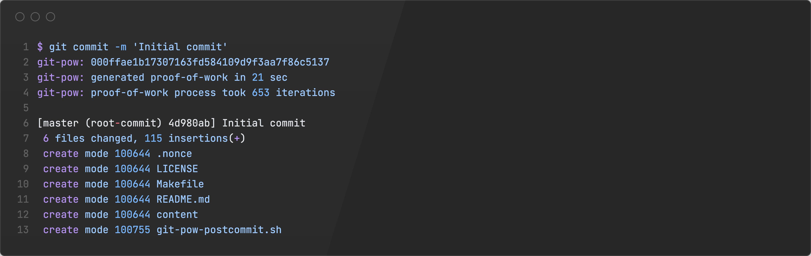
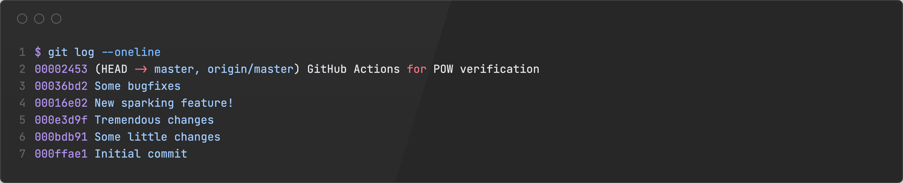
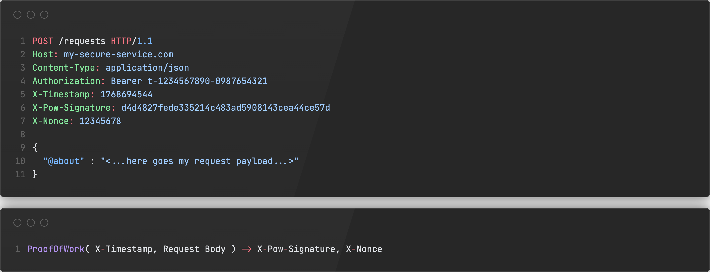

Once upon a time, an unexpected idea struck me: what if we could integrate Proof-of-Work (POW) directly into Git commits?
Let's find out together!

What is Proof-of-Work?
In cryptography (and especially in cryptocurrencies), Proof-of-Work (POW) is a consensus mechanism:
in order to perform a certain action (like adding a new block to the blockchain),
a participant must solve a computationally intensive puzzle, thus "paying" with their computational resources.
At the same time, the solution to this puzzle should be easy to verify by others.

In Bitcoin, for example, miners compete to find a **nonce** that, when combined with the block's data and hashed,
produces a hash that meets specific criteria (usually a certain number of leading zeros).
This process requires significant computational power, but once a valid nonce is found,
other nodes can quickly verify the solution by hashing the block data with the nonce and checking the result.

What a coincidence! Git already uses SHA-1 (or SHA-256 in newer versions) hashes to identify commits,
which means we could try to build a POW mechanism around Git commits.
This mechanism would require finding a nonce that, when combined with the commit data, produces a hash that meets our POW criteria.
In other words, if you want to make a commit, you have to "work" for it by finding a valid nonce.

Let's try to implement this idea!

# Implementing a Git commit miner

To begin with, let's recall how Git commits work.
Once you stage your changes and run `git commit`, Git creates a commit object that includes (among other things):

- A reference to the parent commit(s)
- A unique hash (SHA-1 or SHA-256) that identifies the commit

This hash is computed based on the commit's content, including the author, date, message, and the tree of files.
So, we could introduce an extra data file (let's call it `.nonce`) that will store the nonce value used for POW.
Our goal is to find a nonce such that when we compute the hash of the commit (including the `.nonce` file),
the resulting hash meets our POW criteria (e.g., starts with a certain number of leading zeros).
This process is random - we cannot say that one nonce value is any closer to the desired hash than another.

For this proof-of-concept, let's define our POW criteria as follows:
the commit hash must start with at least three leading zeros (`000`).

The easiest way to implement this is to create a Git post-commit hook that will:

- Check the last commit's hash;
- If the hash doesn't have at least 3 leading zeros, it will:
  - Increment the nonce value in the `.nonce` file;
  - Amend the last commit with the new nonce value (so Git will recompute the commit hash);
  - Repeat until a valid hash is found.

I have written a simple bash script to achieve this: `git-pow-postcommit.sh`.
Well, to be honest, I did use a bit of AI to build a skeleton, but then rewrote it myself, as any responsible developer would.

```bash
#!/usr/bin/env bash
set -euo pipefail

# Prevent accidental recursion
if [[ "${GIT_POW_RUNNING:-}" == "1" ]];
then
  exit 0
fi

REPO_ROOT="$(git rev-parse --show-toplevel)"
NONCE_FILE="$REPO_ROOT/.nonce"
START_TS="$(date +%s)"

function read_nonce() {
  if [[ -f "$NONCE_FILE" ]]; then
    if read -r VALUE < "$NONCE_FILE" && [[ "$VALUE" =~ ^[0-9]+$ ]]; then
      echo "$VALUE"
    fi
  else
    printf "0\n" > "$NONCE_FILE"
    git add "$NONCE_FILE" >/dev/null 2>&1 || true
    echo "0"
  fi
}

function write_nonce() {
  local NONCE="$1"
  printf "%s\n" "$NONCE" > "$NONCE_FILE"
  git add "$NONCE_FILE"
}

function run_pow_iteration() {
  NONCE=$((NONCE + 1))
  ITERATION=$((ITERATION + 1))

  write_nonce "$NONCE"

  GIT_POW_RUNNING=1 GIT_AUTHOR_DATE="$GIT_AUTHOR_DATE" \
    GIT_COMMITTER_DATE="$GIT_COMMITTER_DATE" \
    git commit --amend --no-edit --no-gpg-sign --no-verify >/dev/null
  COMMIT_HASH="$(git rev-parse HEAD)"

  printf "\033[2K\rgit-pow: %s (iteration %s)" "$COMMIT_HASH" "$ITERATION"
}

NONCE="$(read_nonce)"
GIT_AUTHOR_DATE="$(git show -s --format=%aI HEAD)"
GIT_COMMITTER_DATE="$(git show -s --format=%cI HEAD)"
LAST_PRINT_TS="0"
COMMIT_HASH="$(git rev-parse HEAD)"

ITERATION=0
while [[ ! "$COMMIT_HASH" =~ ^000 ]]; do
  run_pow_iteration
done

END_TS="$(date +%s)"
ELAPSED_SEC=$((END_TS - START_TS))
printf "\033[2K\rgit-pow: %s\n" "$COMMIT_HASH"
printf "git-pow: generated proof-of-work in %d sec\n" "$ELAPSED_SEC"
printf "git-pow: proof-of-work process took %d iterations\n\n" "$ITERATION"
```

This script should be placed in the `.git/hooks/post-commit` file of your repository and made executable:

```bash
mkdir -p .git/hooks
cp git-pow-postcommit.sh .git/hooks/post-commit
chmod +x .git/hooks/post-commit
```

Now, every time you make a commit, the post-commit hook will run and ensure that the commit hash meets our POW criteria.
Note that this "mining" process will take a certain time - that's the whole point of POW!
You have to pay with your computational resources to make a commit.



A bit of nitpicking: you might notice that the commit notification generated by Git doesn't show the final commit hash after POW is completed.
That's because the post-commit hook runs _after_ the commit is created, so the initial commit hash is displayed.

Now, let's make some commits and see how it works!



Did you notice that each commit hash starts with at least three leading zeros?
This is the purpose of our POW mechanism!

# Implementing a verification script

At this point, we have a working Proof-of-Work miner for Git commits.
But this is not nearly enough - we also need a way to verify that the POW was correctly performed for each commit.
Surely, if a developer has installed this post-commit hook, they can trust that their commits are valid.
But what about malicious developers? They could simply bypass the hook and create commits without POW.

To address this, we will create a simple verification script: `git-pow-verify.sh`.
This script will simply check each commit's hash to ensure it meets our POW criteria (starts with three leading zeros).

```bash
#!/usr/bin/env bash
set -euo pipefail

for COMMIT in "$(git log --format=%H)"; do
    printf "%s: " "$COMMIT"
    if [[ ! "$COMMIT" =~ ^000 ]]; then
        printf "FAIL\n"
        printf "Proof-of-Work verification failed for commit '%s'\n" "$COMMIT"
        printf "Expected commit hash to start with '000'\n" "$COMMIT"
        exit 1
    fi

    printf "OK\n"
done

printf "All commits have valid Proof-of-Work\n"
```

In our CI/CD pipeline, we can run this script to ensure that all commits in the repository have valid POW.
A developer could still try to push a non-POW commit, but the CI/CD pipeline would be broken forever for this branch.
Normally, we of course should have a rejection mechanism on the server side (like Git hooks on the remote repository),
but this is outside the scope of this proof-of-concept.

# Performance evaluation

The idea of POW is centered around the concept of computational work.
Therefore, a valid question arises: how expensive is this work in practice?

I have made several commits to my test repository using the POW mechanism,
and recorded the time taken and the number of iterations required to find a valid nonce for each commit:

| Commit     | Duration | Iterations | Iterations per second |
| ---------- | -------: | ---------: | --------------------: |
| `000ffae1` |   21 sec |        653 |         31.1 iter/sec |
| `000bdb91` |   83 sec |       2352 |         28.3 iter/sec |
| `000e3d9f` |   69 sec |       2123 |         30.8 iter/sec |
| `00016e02` |   39 sec |       1260 |         32.3 iter/sec |
| `00036bd2` |  110 sec |       3484 |         31.7 iter/sec |

So, the mean performance was around `30.8` iterations per second.
On your machine this number may vary, depending on CPU performance and other factors.

And how many iterations are needed on average to find a valid nonce?
Since we are looking for hashes that start with three leading zeros,
we can estimate that we need to try no more than `16^3 = 4096` different nonces.

However, due to the randomness of hash functions, the actual number of iterations may vary significantly:

- Sometimes, we would need fewer iterations (lucky guesses);
- Sometimes, we would need more iterations (unlucky guesses and _partial_ hash collisions).

During my little experiment, the average number of iterations required was `1974`.
Therefore, we might expect about `60` seconds per commit on average.

Let us estimate how many leading zeros we should require for our POW.
The number of the leading zeros is basically the level of complexity for our POW computational task.
In fact, I ran some extra experiments on my machine to assess the feasibility of each level of complexity.

| Leading zeros | Max iterations | Max duration  | Feasibility                          |
| :------------ | -------------: | :------------ | ------------------------------------ |
| `0`           |            `0` | Instant       | That's how normal Git works          |
| `1`           |         `16^1` | < 1 second    | You won't notice it                  |
| `2`           |         `16^2` | < 10 seconds  | Just a bit of wait                   |
| `3`           |         `16^3` | < 2.5 minutes | You would probably get bored a bit   |
| `4`           |         `16^4` | ≤ 36 minutes  | That's about 1 commit per a work day |
| `5`           |         `16^5` | ≤ 9.5 hours   | Not really feasible                  |
| `6`           |         `16^6` | ≤ 6 days      | No                                   |
| `7`           |         `16^7` | ~ 3.5 months  | No way                               |
| `8`           |         `16^8` | ~ 4.5 years   | Forget about it                      |

Honestly, I couldn’t bring myself to wait for even a single iteration at level 4...

Surely, our implementation is extremely inefficient: we run Git command `git commit --amend` repeatedly, which adds significant overhead.
We could greatly improve the performance by directly manipulating Git objects and computing hashes ourselves,
so we wouldn't have to re-create the entire commit each time.
While this idea could give us a huge performance boost (it's safe to expect about 1 000 000 iterations per second on a modern CPU),
it is outside the scope of this proof-of-concept.

# What's next?

Today we've learned a bit or two about Proof-of-Work as a concept.
But how could we use this knowledge now?

## First of all

Please do not ever consider actually implementing this POW for your Git workflows!
Your colleagues are going to develop an unspeakable level of hatred towards it - and by extension to the person who proposed the idea,
including myself.

It's merely a toy project, fun to learn and play around with - but nothing more.

## POW-backed rate limiter

Imagine you have a system with publicly available API, and you are looking
for a way to ensure any client won't be able to issue too many requests per minute.

You might try to require a POW-based signature for every API request,
forcing your clients to "pay" for their requests with their computational resources:



A malicious client would have to do the same amount of work as a legitimate client,
thus a DoS attack would become economically unfeasible.

## Building a blockchain-like system on Git

You might find it reasonable to use Git and customized Git clients to build a custom blockchain-like system.

Say, you need to build a POW-based document storage system - utilizing Git as a storage layer
and leveraging its commit hashes as a way to sign documents might not really be a bad idea.

# Conclusion

You may try to play with this POW mechanism - everything is available on [GitHub](https://github.com/kapitanov/git-pow).

I hope you had a bit of fun today!
