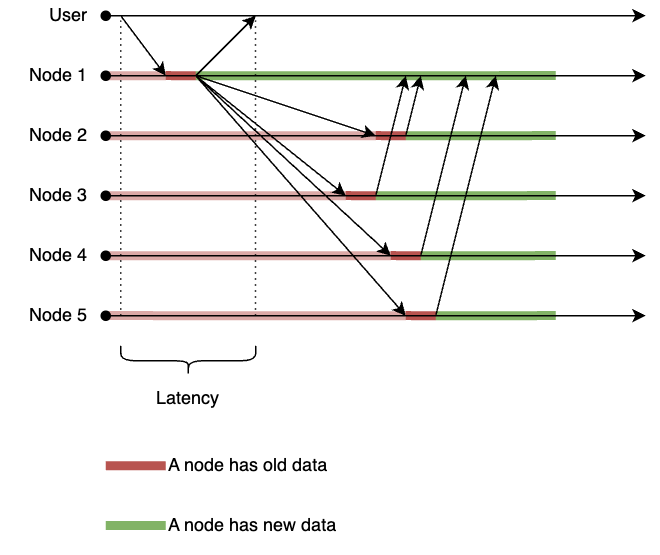

[The last time](../cap-theorem/index.md) we spoke about the CAP theorem,
we saw how it describes the trade-offs between Consistency, Availability when a system experiences a Network Partitioning.
Today, we will expore another side of distributed systems trade-off: the PACELS theorem.

The PACELS theorem (often pronounced as `pack-else`) was proposed by [Daniel Abadi in 2010](https://dbmsmusings.blogspot.com/2010/04/problems-with-cap-and-yahoos-little.html)
as an extension to the CAP theorem.
While the CAP theorem focuses only on the behavior of a distributed system during a network partition,
the PACELS theorem also pays lots of attention to a different state of a system - a state without any network partitions.

Similarily as we did with the CAP theorem, we won't just quote it and call it a day, instead, we will try to devise it outselves from the ground up.

## Terms

But first, we should agree on the terminology! Two terms will be important for us today:

- **Latency** - the PACELS theorem operates with the Latency as a (client-observed) duration of a write operation.
  The longer a client would have to wait until a write operation he has initiated completed - the higher the latency would be.
- **Consistency** - while the CAP theorem operates only with the strong consistency (linearizability), for the PACELS theorem the consistency is a spectrum:
  it might vary from the strong consistency to the eventual consistency.

## Setting up the stage

We are going to use a simple key-value store as a model for our throught experiment.
This distibuted system would:

- be able to execute only one operation - `write`;
- consist of N nodes (obviously, at least two nodes - otherwise it won't be a distributed system);
- accept and execute `write` operation requests on each node;
- store the whole data set on each node (i.e., replicate all writes to all nodes).

The overall design of this toy key-value store would look like this:


For illustration, here's a simple API definition for such a system:

```protobuf
package our.example.system;

service CapTheoremService {
  rpc Write (WriteRequest) returns (WriteResponse);
}


message WriteRequest {
  int64 value = 1;
}
message WriteResponse { }
```

We won't focus on data read operations today, but we will assume that the system is able to read data as well.

## Maximizing consistency

At first, we will try to ensure the strong consistency for our system.
This means that a write operation should be considered completed only when all nodes have acknowledged it.
Therefore, the write operation could only complete when the data change has been replicated to all nodes.


This design would ensure that data consistency is maximized - once a write operation is completed, all nodes would have the same data.
However, this comes at a cost of increased latency - the write operation would have to wait for the slowest node to acknowledge it.
In a real-world scenario, this could be further exacerbated by network delays, node failures, or other issues that could slow down the replication process.

Still, this design would provide the strongest consistency guarantees possible.

## Minimizing latency

Next, we will try to minimize the latency of our system.
To achieve this, we could modify our write operation to complete as soon as the data is written to the first (entry) node,
without waiting for the replication to other nodes to complete.
The replication process would occur asynchronously in the background.



This design would significantly reduce the latency of write operations, as they would complete as soon as the entry node acknowledges them.
However, this comes at the cost of reduced consistency - there is a window of time during which not all nodes have the same data.
If a read operation is performed during this window, it may return stale data from nodes that have not yet received the latest write.

Even worse, a failure of the entry node before replication completes could lead to data loss,
despire the write operation being acknowledged to the client!

## The trade-off

As we can see, there is a clear trade-off between maximizing consistency and minimizing latency in our distributed system:

- Maximizing consistency leads to higher latency, as write operations must wait for all nodes to acknowledge them.
- Minimizing latency leads to reduced consistency, as write operations can complete before all nodes have the latest data.

Remembering the CAP theorem, we might think that this is a binary choice - either we have consistency or low latency.
Let's prove that this is not the case.

We will alter the design of our system to allow for a configurable trade-off between consistency and latency.
We can introduce a parameter `W` (write quorum) that specifies the number of nodes that must acknowledge a write operation before it is considered complete.
In this way, the value of `W` would affect both the consistency and latency of the system:

- With `W=N` we would have the strongest consistency - as we have seen before in the ["Maximizing consistency"](#maximizing-consistency) chapter.
- With `W=0` we would have the lowest latency - as we have seen before in the ["Minimizing latency"](#minimizing-latency) chapter.
- With `0 < W < N` we would have a balance between consistency and latency - the higher the value of `W`, the stronger the consistency and the higher the latency, and vice versa.

Let's illustrate one example - with `W=N/2 + 1` (majority quorum):


This design would provide a middle ground between consistency and latency.
While the strong consistency is lost, the system would still provide a reasonable level of consistency:

- The majority of nodes would have the latest data after a write operation completes.
- The latency would be defined by the latency of the slowest node in the majority, which is typically lower than waiting for all nodes.
  That said, the latency would still be higher than waiting for just one node, but it would be affected in a lesser degree by the latency spikes on a single node.

A good example of such a system is MongoDB, which allows clients to configure the write concern for write operations,
including options for majority quorum - via so called **write consern** option.

## Finally, the PACELS theorem

While we can clearly see the connection between our thought experiment and the CAP theorem, there are some important differences to note:

- The CAP theorem focuses on the trade-offs during network partitions.
  We put our focus on the other case - when there is no network partition.
- The CAP theorem presents a binary choice between consistency and availability during partitions.
  We demonstrated a spectrum of trade-offs between consistency and latency in the absence of partitions.

All of this leads us to the PACELS theorem:

> In the presence of a network partition, a distributed system must choose between strong consistency and availability.
> Else, when there is no network partition, a distributed system must choose between latency and the degree of consistency.

It's easy to remember and decode the name of the theorem:

- `PAC` means: "if **P**artition happens, choose between **A**vailability and **C**onsistency" - the CAP theorem.
- `ELS` means: "**E**lse, choose between **L**atency and **C**onsistency".

Now, it's a great theorem - its whole meaning is encoded in its name!

## P.S.

I would like to note one point, important for the completeness.

In the CAP theorem, we speak about strong consistency (linearizability) only.
However, in the PACELS theorem, the consistency is a spectrum - from strong consistency to eventual consistency.
And eventual consistency is non-binary - there are different degrees of eventual consistency:

- Ensuring that N-1 nodes might serve the stale data for some time is a weaker form of eventual consistency.
- Ensuring that only the minority of nodes might serve the stale data for some time is a stronger form of eventual consistency.
- Ensuring that not a single node might serve the stale data for some time is a strong consistency, not an eventual one.

It's a caveat worth mentioning!
