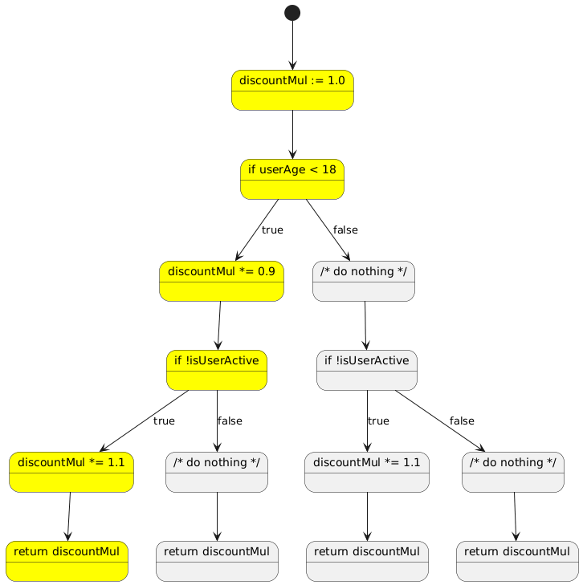

When we write production-grade code, we want confidence that it behaves as expected.
One of the main ways to achieve that is through unit tests — small automated checks verifying that specific parts of the code work correctly.

Naturally, this raises a few questions: How many tests do we need? And how effective are they?
A common answer is test coverage — a metric showing how much of the codebase is executed during testing.

Many teams use test coverage as a quality gate: if the number drops below a threshold, new code can’t be merged.
But these thresholds are often arbitrary — high enough to feel safe, yet low enough to be achievable.
75%, 80%, 85% — familiar numbers that might look meaningful but rarely are.

Before relying on coverage as a quality signal, we should ask:

* What does test coverage actually tell us?
* How useful is it as a metric?
* Does a certain percentage guarantee well-tested code?

This post explores those questions and shows why high coverage can still be misleading.

## Deceiving coverage

For a start, let's write a simple function that calculates a discount multiplier based on user age and activity status:

* For users under 18 years old, we give a 10% discount (multiplier 0.9).
* For inactive users, we apply a 20% discount (multiplier 0.8).
* For users who are both under 18 and inactive, we apply both discounts (multiplier 0.72).
* For all other users, no discount is applied (multiplier 1.0).

Here is the code for these requirements (I've chosen Go, but the language itself is not important here):

```golang
package main

func CalcDiscount(userAge int, isUserActive bool) float64 {
    discountMul := 1.0

    if userAge < 18 {
        discountMul *= 0.9 // 10% discount for minors
    }

    if !isUserActive {
        discountMul *= 0.8 // 20% discount for inactive users
    }

    return discountMul
}
```

It's worth noting: this function is really simple, but that's intentional.
I want to have something very simple to make my points clear.
Later, I will analyze the code to devise better test cases.

Now, let's write some tests for this function.
And since we are going to talk about test coverage, let's measure it as well — and use the test coverage as a metric:

```go
package main

import (
    "fmt"
    "math"
    "testing"
)

func TestCalcDiscount(t *testing.T) {
    type TestCase struct {
        UserAge      int
        IsUserActive bool
        Expected     float64
    }

    testCases := []TestCase{
        // Test Case 1 - user age < 18 and user is inactive
        {UserAge: 17, IsUserActive: false, Expected: 0.72},

        // Test Case 2 - user age ≥ 18 and user is active
        {UserAge: 30, IsUserActive: true, Expected: 1.0},

        // Test Case 3 - user age < 18 and user is active
        {UserAge: 17, IsUserActive: true, Expected: 0.9},

        // Test Case 4 - user age ≥ 18 and user is inactive
        {UserAge: 25, IsUserActive: false, Expected: 0.8},
    }

    for _, testCase := range testCases {
        testCase := testCase
        testCaseName := fmt.Sprintf(
            "%d-%t",
            testCase.UserAge,
            testCase.IsUserActive,
        )
        t.Run(testCaseName, func(t *testing.T) {
            actual := CalcDiscount(testCase.UserAge, testCase.IsUserActive)

            delta := math.Abs(actual - testCase.Expected)
            const epsilon = 0.00001
            if delta > epsilon {
                t.Errorf("Expected %v, got %v", testCase.Expected, actual)
            }
        })
    }
}
```

I'm going to run these tests with different sets of test cases and measure coverage:

```shell
$ go test -covermode=count -coverprofile=/dev/null
PASS
coverage: 100.0% of statements
ok      github.com/kapitanov/blog/posts/code-examples/code-1   0.211s
```

My end goal for now is to reach 100% coverage,
and I'm not going to look into the function code itself while writing the tests.
Yes, it's really simple, but let's pretend it's more complex — too complex to properly analyze manually.
Thus, we'd have to rely on code coverage.

I'm going to add test cases one by one and measure coverage after each addition:

* Without any tests, we have zero coverage, which makes sense.
* With only one test (**Test Case 1**), we already have 100% test coverage!
  This might look correct at first glance — as we cover both `true` and `false` branches of each `if` statement.
  But requirements-wise, we still don't have test cases for the remaining scenarios.
* Adding more test cases does not change coverage — it remains at 100%.

Therefore, if I relied on test coverage as a metric and had a 100% coverage threshold
(and the code were too complex to analyze manually),
I would end up with a false sense of security — thinking that my function is properly tested
while it's not even remotely so.

## Digging deeper

To unveil the mystery, let's put the statements onto a call graph and analyze which branches are covered by which test cases:



As an example, I've highlighted **Test Case 1** in the graph — and we can clearly see
that it only covers 25% of the entire call graph!
Now it's clear: to properly test the function, we need to cover all branches of the call graph,
so we need exactly four test cases to cover all branches.

As you might have guessed, there are different types of code coverage:

* **Statement coverage** — measures whether each statement in the code was executed.
  This is what we measured in the previous examples.

  Even a single test case was enough to achieve 100% statement coverage.

* **Branch coverage** — measures whether each branch (`true`/`false`) of control structures (if, switch, for) was executed.
  For our example, **Test Case 1** would cover two branches — the `true` branch of the first `if`
  and the `false` branch of the second `if` — out of a total of four branches,
  giving us 50% branch coverage.

  Out of curiosity — we could get 100% branch coverage with just two test cases:

  * **Test Case 1** — user age < 18 and user is inactive
  * **Test Case 2** — user age ≥ 18 and user is active

* **Path coverage** — measures whether all possible paths through the code were executed.
  In our example, we have four possible paths through the function,
  which means that **Test Case 1** only covers one out of four paths,
  resulting in 25% path coverage.

  We would need all four test cases to achieve 100% path coverage.

Most testing tools provide statement coverage; some might provide branch coverage — but as we have seen,
neither of these types of coverage guarantees a proper level of verification.

Only path coverage may guarantee that all possible scenarios were tested.
But is it feasible to achieve path coverage in real life?
Let's take a look at another code example:

```go
package main

import "slices"

// MinOf returns the minimum value from a slice of integers.
// It doesn't allow empty slices as input.
func MinOf(xs []int) int {
    if len(xs) == 0 {
        panic("empty slice")
    }

    slices.Sort(xs)
    return xs[0]
}
```

This function has two branches — one for empty slices and one for non-empty slices.
So, would it be enough to have two test cases — one with an empty slice and one with a non-empty slice?

The answer is no — because the `slices.Sort` function itself has branches and paths that we don't control.
Moreover, it's a library function — we don't know its implementation details,
and they might change even between minor releases of the toolchain.

And finally, let's take a look at a slightly trickier example:

```go
package main

func ComplexCondition(a, b, c bool) bool {
    if a || (b && c) {
        return true
    }
    return false
}
```

It seems that there are only two possible execution paths here — one where the condition is true and one where it's false.
But in reality, there are four possible combinations of input values (a, b, c)!
Let's rewrite the condition to make it more explicit:

```go
package main

func ComplexConditionExplicit(a, b, c bool) bool {
    if a {
        return true
    }

    if b {
        if c {
            return true
        }
        return false
    }

    return false
}
```

Now we see — we need four test cases to cover all possible paths through the function.
This unfortunately means that even with 100% path coverage,
we might need to write more tests than we initially thought.

## Conclusion and a few thoughts

Generally, test coverage is a useful metric to have — it can help us identify untested parts of the code.

But we should be aware of its limitations: even 100% statement or branch coverage does not guarantee
that our code is properly tested.
In fact, it does not even come close to guaranteeing that.

At the same time, achieving 100% path coverage is often infeasible.
Even if we manage to achieve it — our tests won't survive any code changes.

Thus, I recommend following a simple rule:

> Until you have 100% coverage of the *testable* parts of your codebase, you do have untested code.
> Once you have 100% coverage of the *testable* parts of your codebase, you still might have untested code.

Here are a few steps to help you follow this rule:

1. **Not every bit of code needs to be tested.**

   Identify critical parts of your codebase that require proper testing.
   It's likely you won't even need tests for infrastructure code, glue code, and similar.

   * Do you really need to unit-test your logger setup or HTTP server initialization?
     Probably not — these parts of your codebase should be tested implicitly during integration testing stages.
   * Do you need to unit-test your business logic?
     Most likely, yes — these parts are critical and should be properly tested.

   Write test scripts that calculate test coverage for these critical parts only.
   Even if some other units are indirectly covered by these tests — their coverage should not affect the resulting number.

2. **Aim for 100% (full) coverage of the testable parts of your code.**

   Having less than 100% (as we observed above) guarantees you don't have well-tested code!
   100% test coverage, on the other hand, means nothing — you still have to carefully design your tests and test cases.
   Thus, you should aim for 100% coverage, but not rely on it.

3. **Be pragmatic.**

   You won't be able to achieve 100% all the time — often you'll have lines of code that are not testable.
   In Go, it would be really painful (and usually unnecessary) to properly test
   all the error-handling `if err { return err }` lines.
   Leave these lines untested — otherwise, you might end up wasting time writing fragile tests
   for code that has no business value.

   Still, aim for 100% — if you have 95% coverage, it means that you have untested code.
   If you do — make sure you know which code is untested and why.

   Review code coverage regularly — for each pull request, for example.
   You should pay extra attention to source code lines that belong to the critical parts of the codebase
   and are not covered by tests.

4. **Don't rely on code coverage thresholds.**

   * Don't set arbitrary thresholds like 75%, 80%, or 85% — they are meaningless.
   * Don't set a 100% threshold either — it's often infeasible to achieve.
   * Don't set different thresholds for different parts of the codebase — that's meaningless as well.
   * Don't set a “coverage should never decrease” rule — it doesn't make sense.

5. **Unit tests are never enough.**

   Imagine that you have managed to achieve 100% path coverage of your entire codebase (somehow).
   Would it guarantee that your code works as expected?
   The answer is no — even totally correct code might fail in production due to misconfiguration, network issues, hardware failures, etc.

   Thus, you should also have integration tests, end-to-end tests, and other types of tests.
   Unit tests (and their coverage) are merely a tool — one of the tools you should keep on your belt.

These recommendations are obviously opinionated; however,
I personally follow them in my projects and find them useful.

Hope you find them useful as well!
