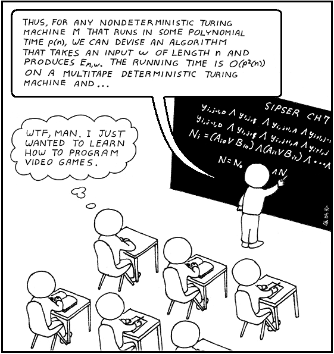
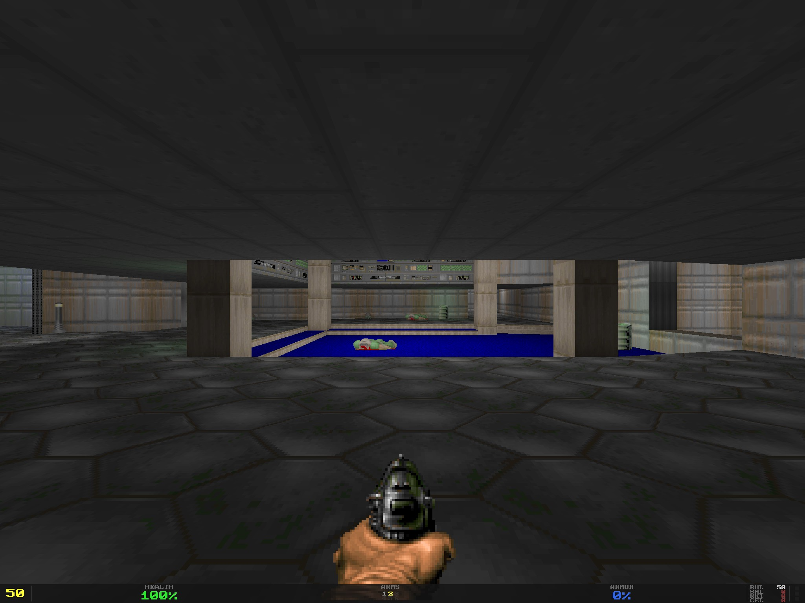
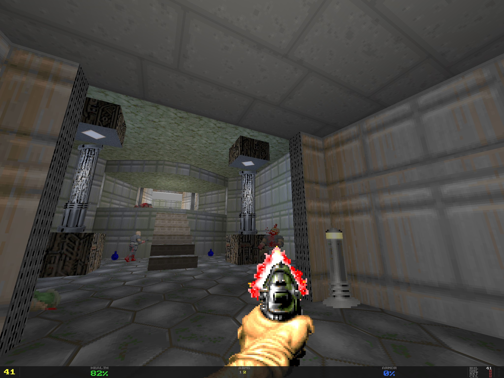
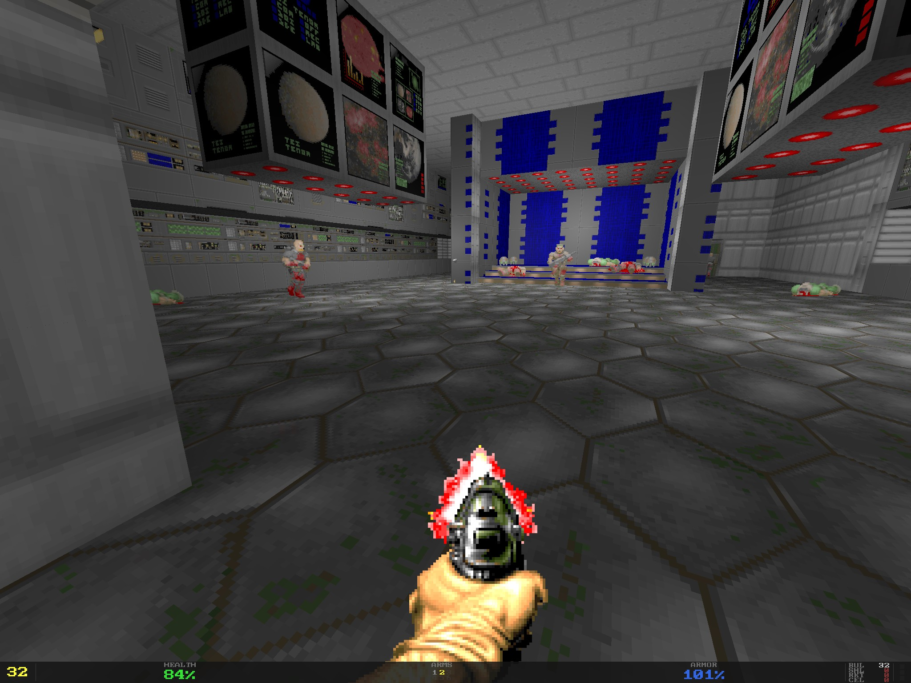
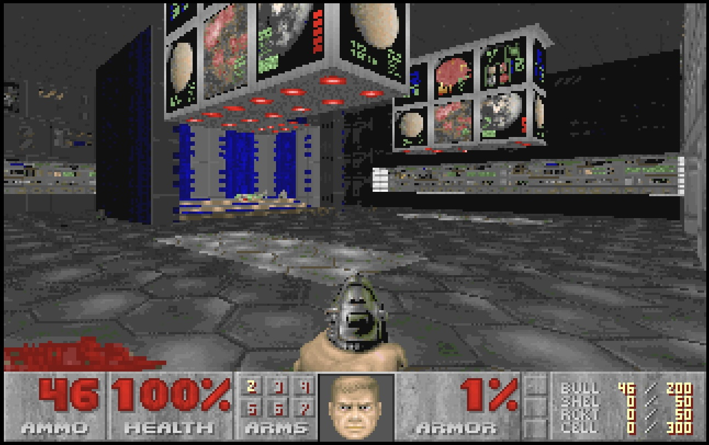
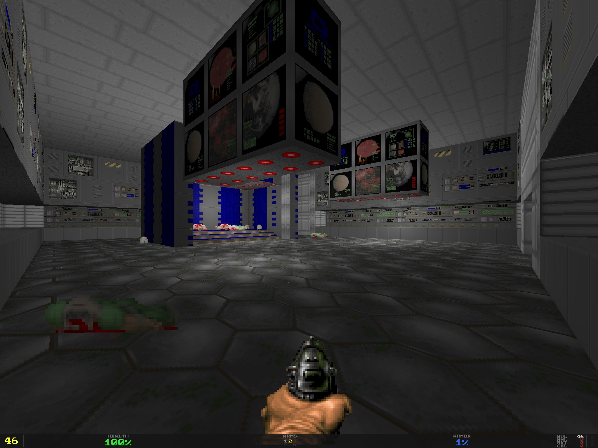

Nowadays, lots of people are enthusiastic about AI-driven software development (should I say, way too enthusiastic sometimes...).
I, however, have remained somewhat cautious about the whole fuss - but so far my skepticism was based more on intuition than on solid facts.
Perhaps I felt that AI might steal from us the joy of building things from scratch.

Finally, I decided to try it myself and to devise a more solid and well-defined position on the whole AI-coding thing.
Today my little experiment is over and I'm glad to share its results!

# The Task

I have to admit - I've always been fond of game programming!

([credits](https://www.elchiguireliterario.com/2009/11/16/wtf-man-i-just-wanted-to-learn-to-program-videogames/))

Back in my earlier days, I learned a few things about game programming: OpenGL, DirectX, shadow maps, deferred shading, an entity-component system...
All those things were learned by example, with a keyboard and a compiler in my hands.
But one great thing had escaped my attention: DOOM.
Probably one of the most iconic shooter games ever, one of the most well-studied ones, and certainly the most portable one.
If you have a computer-like device and it cannot run DOOM - it's not a computer-like device at all!

Sure, I've read posts and articles about DOOM and the [Game Engine Black Book](https://fabiensanglard.net/gebb/)
(which is a great book on DOOM game engine internals, and I strongly recommend it!),
but I've never ever tried to program a clone of DOOM.

Therefore, my choice of a task to run my vibecoding experiment on was obvious: I've decided to vibecode DOOM!
Besides the overall fun of building a clone of DOOM (just because it's cool!), there were a few more logical reasons to do so:

- The DOOM engine, its logic, implementation details and storage formats have been open-sourced for a long time.
  They are well-studied, lots of clones were already written - and I expected AI to be able to just Google whatever information it needed.
- There is a freely distributed shareware version of DOOM, which could be used as a source of maps, textures, sounds.
- DOOM is not a complicated game; it lacks many things common in more modern games: physics, scripts, complicated visuals.
  It is relatively simple, and I hoped to limit the scope and duration of my little experiment.

# Starting the project

At the beginning, I decided to play a very non-technical role:
I was supposed to give high-level inputs, define game-level objectives, run manual tests,
but I wasn't supposed to write any code myself or offer any code-level solutions or approaches.
I tried to be a game designer, not a game programmer.

Spoiler: I still wrote a bit of the code... just couldn't help myself.
However, I'm convinced that my actions didn't really interfere with the results of the whole experiment.
After all, I've only changed very few lines of code.

To start, I wrote a short top-level document - you can find it [here](https://github.com/kapitanov/ccdoom/blob/master/docs/DESIGN_DOCUMENT.md).
Basically, it explains the project as a clone of DOOM with a few key differences:

- Runs on macOS;
- Renders via OpenGL using the [Deferred Shading](https://en.wikipedia.org/wiki/Deferred_shading) technique
  (just for fun - because I implemented this technique myself back in the day and wanted to play with it one more time);
- Doesn't support network play;
- Uses its own intermediate data storage format - a bunch of JSON files instead of a WAD archive;
- (as an extra addition) Supports decals - so the bullets might leave marks on the walls.

As you might see, the design document is very high-level and could be reduced to one sentence - "make me a clone of DOOM for macOS/OpenGL".
This was a deliberate choice, as I expected the AI to figure out all the details on its own: after all, it's DOOM, it's a well-known game.

To help the AI with its reasoning, I've added some gamedev-related skills.

# Progressing through

Having the initial design document, I've started to warm up ~the engines~ Claude Code.

Quite quickly, it devised [a plan](https://github.com/kapitanov/ccdoom/tree/master/docs/roadmap) - a roadmap to implement all the requirements
(including implicit ones) step by step.
It generated a 12-step plan, short enough to review, and I approved it.

After that, the development loop started:

- I tell Claude "please implement the next milestone".
- Claude works for a while, consumes a ton of tokens and finally says "it's done!".
- I test the game manually, mark the most severe bug and tell Claude to fix it.
- The loop goes on and on - until there are no significant bugs I can spot.

So, did it work? Well, you may see it yourself:

# One extra requirement

Before moving forward and trying to analyze the results, I've decided to throw in one extra requirement, a tricky one:
I wanted to have an alternative renderer, based on Path Tracing.

Quite a challenge! But after all, isn't the AI supposed to take the heavy lifting off our shoulders?
Unfortunately, the outcome was... unsuccessful. Surely, Claude managed to write an implementation - but failed miserably trying to make it work as intended.

# Taking a first look at the result

Here is a link to the repository - [github.com/kapitanov/ccdoom](https://github.com/kapitanov/ccdoom).
I encourage you to explore the code yourself and form your own opinion.

Let's start with some statistics:

- ~12.5k lines of code were generated (in Golang);
- ~684.5M tokens were consumed (overall);
- The token cost would have been about $400 if not for the Claude subscription.
- The whole process took about a month (could've been faster - but my Claude subscription is limited, and I was constantly bumping into the usage limits).

What about the game itself?

- It compiles, runs, and is quite playable. I failed to beat the game - but mostly due to lack of time.
- Game saves, map transitions, difficulty levels - all these features work fine.
- Besides the game, a `wadconv` tool was built - it converts the WAD archives into a bunch of plain text files (the game uses them instead of WADs).

Long story short, the strong side of Claude's implementation is: "It works!".
Honestly, it's a great achievement! Just 5 years ago, I would never have believed that
I could just tell the computer "Write me a clone of DOOM from scratch" - and it would.
Today, it's not science fiction anymore - it's a tool available for everyone, just for $20/month.

**Visual quality**

Honestly, I expected at least the same visual quality: the textures and maps are exactly the same,
and the renderer is much more advanced and can use texture filtering and anti-aliasing.

Let's compare (the original vs. the vibecoded clone):

In my opinion, visuals look better than in the original game - which is mostly a matter of technologies
(better shading, anti-aliasing, better color depth, proper texture filtering).

**Audio**

Besides the game itself (game logic, maps, enemies, weapons) - Claude was able to implement audio,
both regular sounds (gunfire, monster growl) and the background MIDI music!
The latter is especially astonishing - it would take me a week to implement something like that from scratch,
and Claude got it working it in less than an hour!

# What went wrong?

Clearly, not everything was great - why would I write this article if it was?

Well, I've faced two kinds of issues: quality-related and code-related.

## Quality issues

Let's start with quality-related issues. First of all, I do consider product quality to be the most important trait to have.
What's the point of having the perfect code that doesn't solve your problem - or solves it too badly and you can't use it for your purposes?

So, what level of quality was Claude Code able to achieve?

**Game Performance**

You'd expect the DOOM game clone to be quite performant on modern MacBooks, right?
After all, the original game was able to maintain a stable 30 FPS (frames per second) on an ancient 80486DX4-100 (it's a microprocessor released in 1989...).

However, this DOOM clone was unable to perform at this level...
Even after two sessions of optimizations (when I asked Claude to improve the performance and it genuinely tried),
the outcome was... mediocre at best.
The game was able to reach 40 FPS for some maps, but for some of them (for example - E1M7)
it could barely squeeze out 20 FPS - barely playable even by the original DOOM's standards!

For such a simple game, rendered with hardware acceleration and running on a machine capable of running Cyberpunk 2077...
Let's be merciful and just say - I was targeting stable 60 FPS.

**Gameplay and Bugs**

For the most part, the game is playable. However, certain bugs still persist even after my (well, mostly Claude's...) attempts to fix them:

- On certain levels, weird visual artifacts were visible.
- Sometimes the player might get stuck near ladders.
- Some enemies might get stuck in nearby walls.
- Decals (bullet marks on the walls) are buggy as hell - if you shoot a closed door and then open it,
  the door would move, but the bullet mark would not!
- Some enemies are able to see (and shoot) through walls.
- Barrels bleed when you shoot them, but they still don't die!
  OK, I expected them to explode, not to bleed, but I would at least hope for some consistency...
  As one great man once said: *"If it bleeds, we can kill it"*.
  Today, I'd have to correct him: *"If it bleeds, we can kill it - unless it's a vibecoded barrel"*.

## Code issues

As we can see, the quality of the resulting game was less than ideal. But perhaps we can fix it?
Fixing the code requires certain prerequisites:

- Reasonable code design. The code should be organized in a logical way, making it easy to navigate and to isolate code changes.
- Proper test coverage. It's important to fix what is broken - but it's even more important not to break anything else. 
  Pre-existing test coverage is essential for this.
- Minimal "tech debt". Usually, changing the code comes with a price - every ad hoc solution comes with a price, and that price is degraded code quality.

Was Claude able to live up to these well-known industry standards?
Not at all!

**Code Design**

To illustrate the whole depth of the vibecoded code pit of doom, I'll ask you a simple question:
if there is a package named `game` and a package named `main` (program's entry point) - where should the player's inventory code be placed in?
If your answer was "in the game package" - congratulations, you just passed Turing's test, and Claude didn't.
It placed this code in both packages! In-map inventory is handled by the `game` package but cross-map carry-over is somehow handled by the `main` package.

Looking at the codebase - there is little logic in the code design at all:

- Some packages (like `engine`) are tiny, while others (`renderer` and `game`) are so large you can't really tell their area of responsibility.
- You'd expect the `bsp.go` file to contain the implementation of the [BSP Tree](https://en.wikipedia.org/wiki/Binary_space_partitioning) - but no,
  most of it is in the `level.go` file.
  And the BSP tree is a data structure that could easily be separated from the rest of the code!
- Behaviors of various enemies are spread across different parts of the code. Adding a new enemy or altering an existing one would be a nightmare!
- I failed to make Claude implement a game menu or ammunition indicators similar to the original game.
  Instead, it implemented something different.

Overall, Claude is as lazy as it gets: it prefers ad hoc solutions and avoids thinking about better, more abstract ways to write code.

**Test Coverage**

Claude didn't really write lots of tests, as any seasoned engineer would expect.
Instead, it sticks to the absolute minimum of them - the whole codebase has only 21 tests!

Surely, I could've requested more tests explicitly - but my experiment was to let Claude take the steering wheel.
And it drove straight through the bushes.

**Tech Debt**

After a month of work, I ended up with a codebase that:

- Sort of works.
- Has weird bugs.
- Barely has any tests.
- Features tons of undocumented code and "magical" constants.
- Most of the code is as far away from "clean code" as it gets - just take a look
  at [this "if-else" operator](https://github.com/kapitanov/ccdoom/blob/master/internal/render/walls.go#L51-L175) that spans across 120 lines of code!
  And it's not a separate "if" operator - it's a part of a "for" loop...
- Manages to perform worse than [The Room](https://en.wikipedia.org/wiki/The_Room) did in theatres.

This makes the code basically unmaintainable. Before making any changes, implementing any new features - a major refactoring is mandatory.

680M tokens gave me 12000 lines of bad code.
I wonder how many tokens would give me something maintainable...

# Conclusion

At this point, enough information was gathered. Time to devise some conclusions.

**MVP implementation**

That's the sweet spot for AI coding. Imagine you want to quickly test a market hypothesis - and you're ready to pay for full-scale re-engineering, if your idea works.

Surely, you would get write-only, throwaway code - but you are going to get it at a low cost.
Launch fast, fail fast, and if you're not failing - reimplement everything from scratch, focusing on things you will need to develop your product further:
quality assurance, maintainability, predictable performance, reliable infrastructure - all the things you may skip at the MVP stage.

**Production-grade code**

However, for production-grade solutions, the focus changes.
When we are not building a "launch fast - fail fast" solution but a solid product, we need a few things Claude failed to deliver:

- **Quality.** Our software should be bug-free - and we should be able to keep it that way.
  Claude failed to fix a few minor bugs - and I should note, I didn't test my little project on a different machine!
  My experience tells me: if I tried, I would be overwhelmed with complicated, hard-to-reproduce bugs.
- **Maintainability.** Unlike an MVP, a launched product is not static anymore:
  it has to maintain the same level of quality and to introduce new, more complicated features at the same time.
  The software engineering industry knows - you can't reliably achieve these goals unless you keep your code, processes and operations at a certain level of maturity.
  Unguided Claude failed at this point too: lazy-written code with a bunch of ad-hoc solutions and very little strategic thinking.
- **Performance.** It's a metric with multiple faces:
  for computer games, we fight for FPS, for backend services - for RPS and latency,
  for frontend, desktop and mobile apps - for fluent user experience.
  Often, to achieve these goals, a certain amount of both strategic and out-of-the-box thinking is necessary.
  Again, Claude failed miserably to demonstrate these engineering capabilities.
  Heck, I even had to explicitly ask it to implement occlusion culling!
  (It's the most basic optimization in 3D graphics - it lets us render only the things that could be seen on the screen, not the whole map)

**More complicated pipelines?**

What if we add more AI? Clearly, if we have a problem with an AI - we need to add more AI!

We could have two AI agents:

- One to write the code;
- And another - to review and tell the first agent what should be fixed.

At this point, I don't have any valid input to prove or to debunk this idea.
However, clearly token costs would skyrocket:

- This project consumed 680M tokens (est. $400 if I had to pay for them);
- With another AI agent to do code reviews and the full-blown "code-review-fix" loop - I'd assume the price would triple,
  about 2B tokens and $1,200 would be spent.

I might explore this approach later, but at this point it seems an expensive solution.

**Human in the loop?**

You might ask: what if we put a human into the development loop? A seasoned engineer could carefully review code changes, drive top-level strategic decisions
while AI would do the groundwork.

In my opinion, this approach would have only a limited amount of success:

- Reviewing AI-generated code is a show stopper in general. AI writes much more code than a human can review properly.
  Very quickly, this process would degrade into LGTM-ing most of the code changes (LGTM means "looks good to me", or in other words - "I didn't even read it").
- Reviewing code you have never worked on yourself is a generally ineffective approach.
  A reviewer is detached from the code: he does not know the codebase intimately, or the logic and history behind it.
  To be an effective reviewer, you need to be a co-author of the code.
- Being a top-level strategist is possible, but in the long run your engineering skills would degrade:
  they are based on the groundwork, writing, debugging, testing and optimizing code,
  and the AI-driven development would likely deprive you of these activities.

All these factors combined might lead the project to an unexpected dead end.
Imagine, we're facing a critical bug, and AI fails to fix it.
Now we need a human engineer to fix it - with all his skills, experience, ability to think out of the box and intuition.
The most complicated bugs in my career were not too hard to fix, but they were very hard to locate, and all these skills, knowledge, intuition
and all other traits of a seasoned software engineer were mandatory to do it.
Clearly, any AI lacks these traits - at best, its capabilities are nowhere near a human's.
An AI might thoroughly read the code, write more tests - but it will never guess that the root cause of the bug might be
in the networking configuration on your production cluster.
A human engineer would.

But these human skills are not just available on demand!
Unlike AI, humans need to keep their skills sharp - both in general and relative to a certain project.
The latter is especially important - you may hire a highly-skilled engineer on the market,
but you cannot hire an engineer that has deep knowledge of your code, product or infrastructure.
These skills are built through dedicated groundwork - and AI takes that groundwork away from engineers.

The AI might help you build an average-level product, but in the long run you would end up in a swamp of mediocrity.
